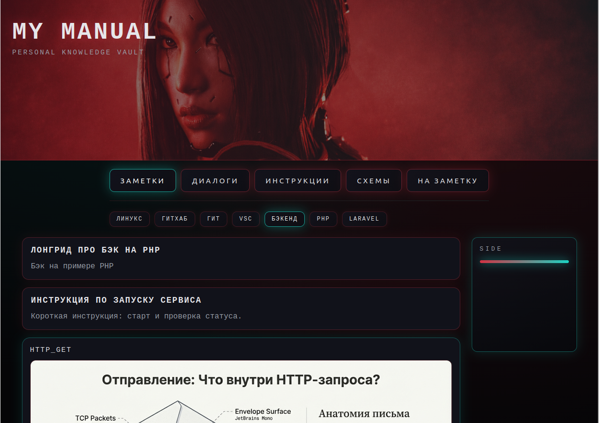

# my_manual

Minimal knowledge base built with Astro and Decap CMS.

## Overview
- Static site with notes and schemes.
- Content is stored in Markdown under `src/content/`.
- Decap CMS is available at `/admin/` for editing notes.

## Tech Stack
- Astro (static build)
- Decap CMS (GitHub OAuth)
- Content Collections

## Routes
- `/` → notes list
- `/notes` → notes list with filters
- `/notes/[slug]` → note detail
- `/schemes` → schemes list
- `/schemes/[slug]` → scheme detail
- `/admin/` → Decap CMS

## Content Structure
```
src/content/notes/   # notes (markdown)
src/content/schemes/ # schemes (markdown)
public/img/          # static assets
public/img/schemes/  # scheme images
```

## Content Frontmatter
Notes (`src/content/notes/*.md`):
```
---
title: Title
structural: ЗАМЕТКИ | ДИАЛОГИ | ИНСТРУКЦИИ | НА ЗАМЕТКУ
topics:
  - ЛИНУКС
---
```

Schemes (`src/content/schemes/*.md`):
```
---
title: Scheme title
topics:
  - VSC
image: /img/schemes/example.png
---
```

## Local Development
```
npm install
npm run dev
```

## Build
```
npm run build
```

## CMS (Decap)
- URL: `/admin/`
- Config: `public/admin/config.yml`
- OAuth handled by external Render Web Service.

## License
Private project.



